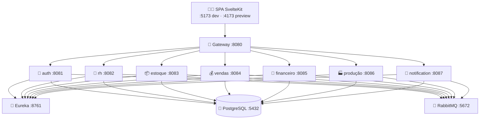

<div align="center">

# 🏭 labSys

### Sistema de Gestão para Fab Lab / Makerspace

Microsserviços **Java 21 + Spring Boot 3** · SPA **SvelteKit 2 + Svelte 5** · **PostgreSQL** · **RabbitMQ**

[](LICENSE)
[](https://openjdk.org/projects/jdk/21/)
[](https://spring.io/projects/spring-boot)
[](https://svelte.dev)
[](https://kit.svelte.dev)
[](https://www.typescriptlang.org)
[](https://tailwindcss.com)
[](https://www.postgresql.org)
[](https://www.rabbitmq.com)
[](https://www.docker.com)

</div>

---

## 📑 Índice

- [Sobre](#-sobre)
- [✨ Módulos](#-módulos)
- [🧱 Arquitetura](#-arquitetura)
- [🛠️ Stack](#️-stack)
- [📁 Estrutura](#-estrutura-do-repositório)
- [🚀 Quickstart](#-quickstart)
- [🧪 Testes](#-testes)
- [🔀 Git Flow](#-git-flow)
- [📚 Documentação](#-documentação)
- [🗺️ Roadmap](#️-roadmap)
- [🤝 Contribuindo](#-contribuindo)
- [📄 Licença](#-licença)

---

## 📖 Sobre

O **labSys** é o sistema gerencial completo de um Fab Lab: pessoas & RH, estoque, vendas & CRM,
financeiro, produção & projetos e notificações — com autenticação JWT + RBAC granular, mensageria
assíncrona e um gateway único na borda. Roda localmente (Ubuntu Server + Docker Compose + Tailscale).

> [!TIP]
> Quer só ver o frontend funcionando? Vá direto para [Quickstart → Frontend](#4-frontend).

---

## ✨ Módulos

### 🖥️ Frontend (SPA SvelteKit) — 9/9 módulos concluídos ✅

| Módulo | Rota | Destaques |
| :--- | :--- | :--- |
| 🔐 Auth | `/auth/login` | JWT, interceptor 401, RBAC granular, forgot-password |
| 📊 Dashboard | `/dashboard` | KPIs, gráficos, tarefas, atividade, polling de não-lidas |
| 🏭 Produção | `/producao` | Projetos, Kanban, máquinas, Sistema 5S completo |
| ⚙️ Configurações | `/configuracoes` | Perfil, usuários, matriz de permissões, sistema |
| 📦 Estoque | `/estoque` | Itens, entradas/saídas, empréstimos, fornecedores, BOM |
| 🔔 Notificações | `/notificacoes` | Central, preferências de canais, histórico (Admin) |
| 👥 Pessoas & RH | `/pessoas` | Cadastro, processo seletivo (Kanban), horas, treinamentos, níveis |
| 💰 Vendas & CRM | `/vendas` | Clientes, orçamentos, Kanban de encomendas, marketplace, marketing |
| 🧾 Financeiro | `/financeiro` | Lançamentos, contas, doações, custeio, relatórios (Admin-only) |

> [!NOTE]
> RBAC é sempre **hide, nunca disable**. Contagem atual: **524 testes verdes** (`vitest`).

### ⚙️ Microsserviços (backend Java)

| Serviço | Diretório | Porta | Responsabilidade |
| :--- | :--- | :---: | :--- |
| 🧭 Discovery | `discovery-service/` | `8761` | Service Registry (Eureka) |
| 🚪 Gateway | `gateway-service/` | `8080` | Roteamento, balanceamento, segurança na borda |
| 🔐 Auth & Identity | `auth-service/` | `8081` | Autenticação, JWT, RBAC, acesso RFID |
| 👥 Pessoas & RH | `rh-service/` | `8082` | Pessoas, processo seletivo, ponto, horas, LMS |
| 📦 Estoque & Suprimentos | `estoque-service/` | `8083` | Insumos, ferramentas, fornecedores, BOM, empréstimos |
| 💰 Vendas & CRM | `vendas-service/` | `8084` | Clientes, orçamentos, Kanban, marketplace, CRM |
| 🧾 Financeiro | `financeiro-service/` | `8085` | Fluxo de caixa, custos (Job Order Costing) |
| 🏭 Produção & Projetos | `producao-service/` | `8086` | Projetos, tarefas, máquinas, 5S, Kanban de encomendas |
| 🔔 Notification | `notification-service/` | `8087` | E-mails e notificações transversais (RabbitMQ) |

> [!NOTE]
> Status vivo de cada service (implementado × scaffold × gaps de contrato): [`docs/contract.gap.md`](docs/contract.gap.md).

---

## 🧱 Arquitetura



---

## 🛠️ Stack

| Camada | Tecnologias |
| :--- | :--- |
| Backend | Java 21 · Spring Boot 3.x · Spring Cloud Gateway · Eureka · Spring Data JPA (Flyway) · Spring Security + JWT · RabbitMQ |
| Frontend | SvelteKit 2 · Svelte 5 (runes) · TypeScript 5 · Tailwind CSS 3 · Vite 6 · Vitest 3 + Testing Library |
| Infra | PostgreSQL · RabbitMQ · Docker + Docker Compose · Nginx/HTTPS · Tailscale |

---

## 📁 Estrutura do Repositório

```
labSys/
├── docs/                       # Bounded Contexts, specs e contract.gap.md
├── discovery-service/          # Eureka Server (8761)
├── gateway-service/            # Spring Cloud Gateway (8080)
├── auth-service/               # Auth & Identity (8081)
├── rh-service/                 # Pessoas & RH (8082)
├── estoque-service/            # Estoque & Suprimentos (8083)
├── vendas-service/             # Vendas & CRM (8084)
├── financeiro-service/         # Financeiro (8085)
├── producao-service/           # Produção & Projetos (8086)
├── notification-service/       # Notification (8087)
├── frontend/                   # SPA SvelteKit + TS + Tailwind
├── infra/                      # Docker Compose, Nginx, PostgreSQL, RabbitMQ
└── .opencode/                  # Specs e estado do pipeline de desenvolvimento
```

---

## 🚀 Quickstart

### Pré-requisitos

| Ferramenta | Versão mínima |
| :--- | :--- |
| ☕ Java (JDK) | 21 |
| 📦 Maven | 3.9+ |
| 🟢 Node.js + npm | 20+ |
| 🐳 Docker + Docker Compose | recente |

### 1. Infraestrutura base

```sh
docker compose -f infra/docker-compose.yml up -d
```

### 2. Discovery + Gateway + serviços

```sh
# cada serviço em um terminal próprio, nesta ordem
cd discovery-service && mvn spring-boot:run
cd gateway-service   && mvn spring-boot:run
cd auth-service      && mvn spring-boot:run
# ... rh, estoque, vendas, financeiro, producao, notification
```

### 3. Seed de acesso (dev)

> [!WARNING]
> Credenciais **exclusivas de desenvolvimento** — nunca promover para produção.

| Usuário | Senha | Origem |
| :--- | :--- | :--- |
| `admin` | `admin123` | seed raiz do `auth-service` |
| `admin@fablab.org` | `admin123` | seed de homologação do frontend |

### 4. Frontend

```sh
cd frontend && npm install

npm run dev      # dev em http://localhost:5173
npm run build    # build de produção (adapter-node)
npm run preview  # preview do build em http://localhost:4173
```

> [!TIP]
> Sem backend no ar, as telas de dados exibem estados de erro amigáveis (contrato parcial).
> Aponte `VITE_API_BASE_URL` para o gateway (`http://localhost:8080/api`, padrão) quando subir os services.

---

## 🧪 Testes

```sh
cd frontend
npm run test    # vitest — 524 testes
npm run check   # svelte-check (0 errors)
```

Backend: `./mvnw test` por service (JaCoCo ≥ 80% nos services implementados).

---

## 🔀 Git Flow

Branches principais: `main` (produção) · `testing` (homologação) · `development` (dev ativo).

- ❌ Nunca commitar direto em `main` ou `testing`
- ✅ Trabalhar em `development` ou `feature/*` · `bugfix/*` · `hotfix/*` · `docs/*`
- 🔁 Ao concluir: PR → `development` → `testing` → `main`
- 🏷️ Commits seguem [Conventional Commits](https://www.conventionalcommits.org/) (`feat`, `fix`, `docs`, `chore`, `test`, `security`, …)

---

## 📚 Documentação

| Documento | Conteúdo |
| :--- | :--- |
| [`docs/`](docs/) | Bounded Contexts (`00–08`), specs por service |
| [`docs/contract.gap.md`](docs/contract.gap.md) | Gaps frontend × backend + fila de implementação por service |
| [`docs/mokups/`](docs/mokups/) | Mockups aprovados por módulo (fonte visual do frontend) |
| [`infra/docs/`](infra/docs/) | `ARCHITECTURE`, `DEPLOY`, `RUNBOOK` |
| [`.opencode/specs/frontend/`](.opencode/specs/frontend/) | Requirements + plans + tasks do frontend (9 features) |

---

## 🗺️ Roadmap

- [x] Auth + Dashboard + App Shell
- [x] Produção (12 telas) + Configurações (4 telas)
- [x] Estoque (10 rotas) + Notificações (3 telas)
- [x] Pessoas & RH (12 rotas) + Vendas & CRM (11 rotas)
- [x] Financeiro (7 rotas, Admin-only)
- [ ] `vendas-service` + `financeiro-service` + `producao-service` (backend)
- [ ] Gateway: rotas `/api/vendas/**`, `/api/financeiro/**`, `/api/producao/**`
- [ ] Enforcement server-side (`@PreAuthorize`, RBAC por criador/titularidade)

---

## 🤝 Contribuindo

1. Abra uma branch a partir de `development` (`feature/minha-feature`)
2. Siga o padrão de código do módulo (front: `pnpm`/componentes do kit, sem `any`; back: records + Jakarta Validation)
3. Rode os testes do módulo antes do PR
4. Descreva no PR: o quê, por quê e como testar

---

## 📄 Licença

**GNU General Public License v3.** Ver [`LICENSE`](LICENSE).
